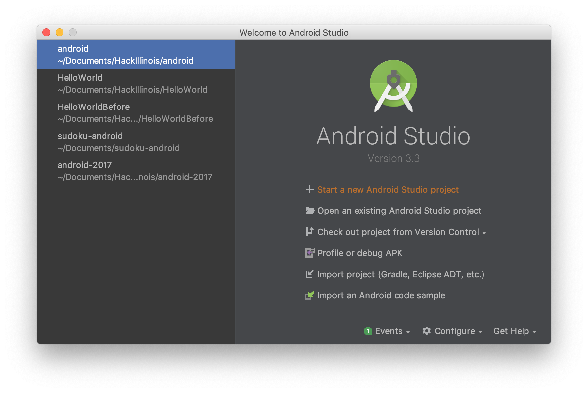
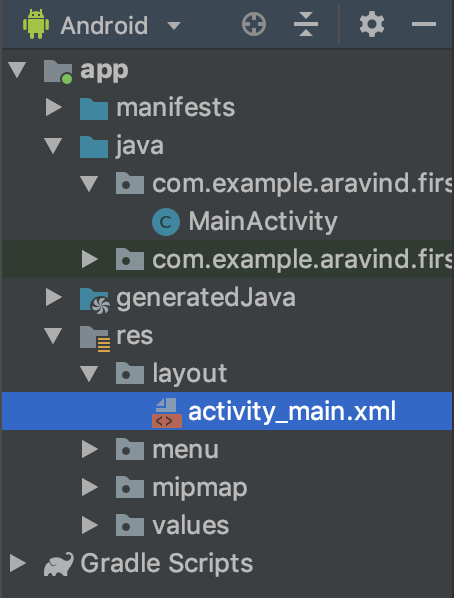

# First Tutorial

This is the first tutorial, building your first Android app!


## Step 1 - Installing Android Studio

Download and install Android Studio from https://developer.android.com/studio. 
Also, make sure you have the JDK installed on your computer: https://www.oracle.com/technetwork/java/javase/downloads/index.html

## Step 2 - Creating a new Project


Open up Android Studio and click Start a new Android Studio project.



Select "Phone and Tablet" and then "Empty Activity". Press Next.


Name your application (MyApp, or whatever you want). Leave the rest of the settings as they are and press "Finish"!


Gradle will set up your project and index everything. This will probably take a few minutes.

## Step 3 - Adding UI

On the left hand side of the screen, go to `res/layout/activity_main.xml`. This is where all the definitions of what your UI will look like go.



Your screen should look like this:


Now, navigate to the Text tab (at the bottom of the window, next to Design). You can now see the code that Android uses to populate
If you go to the Text tab in the XML, you'll be able to see the code generated by Android Studio for the Button.


Here's the actual text to copy into your xml file:
```xml
<LinearLayout
    xmlns:android="http://schemas.android.com/apk/res/android"
    android:layout_width="match_parent"
    android:layout_height="match_parent"
    android:orientation="vertical">

    <TextView
        android:id="@+id/textView"
        android:text="Hello world!"
        android:layout_width="wrap_content"
        android:layout_height="wrap_content"/>

    <Button
        android:id="@+id/button"
        android:layout_width="wrap_content"
        android:layout_height="wrap_content"
        android:text="New Button"
        android:onClick="buttonOnClick" />
</LinearLayout>
```

Basically, everything that you put on the screen is part of a hierarchy, and that hierarchy is defined in the XML by nesting elements. For example, we have the RelativeLayout element, and then inside there is both the TextView and Button elements. Since they are inside the RelativeLayout tags, they are children of the relative layout. Each type of tag has their own fields, but one that is very important is the id field. In our Button, for example, we have `android:id="@+id/textView"`. Basically, we are associated the id "textView" to this specific text view.

Run your code if you wish, and you'll see the new Button below the Hello World!

Now that we have a button, let's make something happen when we press it.


## Step 4 - Making UI Interactive
Navigate to `src/main/java/com.example.aravind.firsttutorial/MainActivity.java` on the left hand side of the screen.

Let's define a method in our MainActivity called buttonOnClick, which will execute an action when the Button is clicked. You may have noticed the `android:onClick="buttonOnClick"` in the xml above. Basically, if we define a function with that name in our MainActivity, it will be called when the button is clicked. Here is the definition of the function:
```Java
public void buttonOnClick(View view) {
    final TextView textViewToChange = findViewById(R.id.textView);
    if (textViewToChange.getText().equals("Hello world!")) {
        textViewToChange.setText("Welcome to SIGMobile!");
    } else {
        textViewToChange.setText("Hello world!");
    }
}
```

Basically, what we do here is first get a Java object of our TextView by using `findViewById`. This allows us to get Java object of the XML based on the ids that we set in the XML. Then, we just change the name of the TextView.

## Step 5

Run your app!


Click the button!


